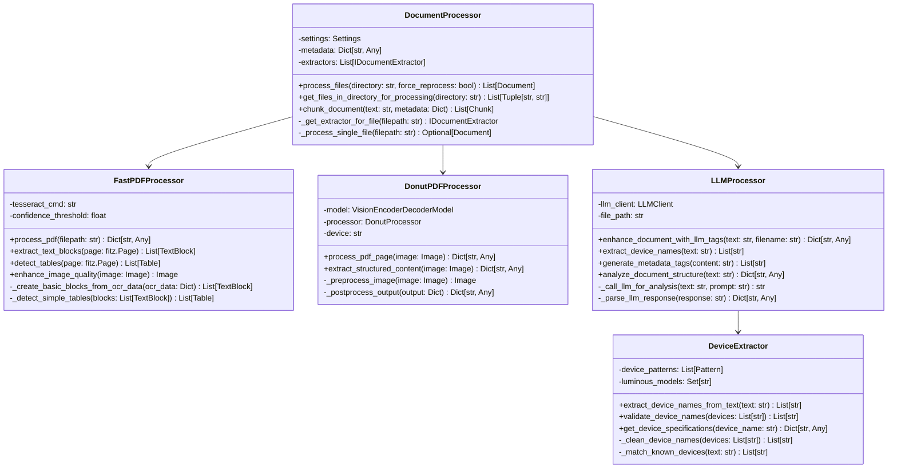

# Luminous Chatbot - Comprehensive Low Level Design (LLD)

## System Overview
This comprehensive LLD document provides detailed class diagrams, interfaces, protocols, and architectural patterns for the Luminous Chatbot system.

## 1. High-Level Architecture Overview


## 2. Core Interfaces and Protocols

### 2.1 Authentication Protocol Interface


### 2.2 Document Processing Protocol


### 2.3 RAG System Protocol


## 3. Detailed Class Diagrams

### 3.1 API Gateway and Authentication Classes


### 3.2 Core Service Classes


### 3.3 Document Processing Classes



### 3.4 Caching System Classes


### 3.5 Database Layer Classes


## 4. Data Models and DTOs

### 4.1 Request/Response Models

```mermaid
classDiagram
    class ChatRequest {
        +conversation_id: str
        +user_id: str
        +message: str
        +context: Optional[Dict[str, Any]]
        +timestamp: datetime
    }

    class ChatResponse {
        +conversation_id: str
        +response: Dict[str, Any]
        +status: bool
        +timestamp: datetime
        +metadata: Optional[Dict[str, Any]]
    }

    class DocumentUploadRequest {
        +file: UploadFile
        +directory: str
        +metadata: Optional[Dict[str, Any]]
        +force_reprocess: bool
    }

    class DocumentUploadResponse {
        +status: str
        +message: str
        +chunks_created: int
        +filepath: str
        +file_type: str
        +llm_detected_tags: Optional[List[str]]
    }

    class FeedbackPayload {
        +conversation_id: str
        +rating: int
        +feedback: Optional[str]
        +inverter_id: Optional[str]
        +inverter_name: Optional[str]
        +embedded_client: Optional[str]
        +user_name: Optional[str]
        +user_email: Optional[str]
        +user_phone: Optional[str]
    }

    class CacheEntry {
        +query: str
        +response: Dict[str, Any]
        +source: str
        +metadata: Optional[Dict[str, Any]]
    }

    class CacheUpdateRequest {
        +new_response: Dict[str, Any]
        +metadata: Optional[Dict[str, Any]]
    }
```



### 4.2 Internal Data Models


## 5. Communication Protocols

### 5.1 HTTP API Protocol


### 5.2 Document Processing Protocol


## 6. Error Handling and Exception Hierarchy


## 7. Performance and Scalability Considerations

### 7.1 Async Processing Architecture


### 7.2 Caching Strategy


## 8. Security Architecture

### 8.1 Security Layers


### 8.2 Data Protection Flow


## 9. Monitoring and Observability

### 9.1 Monitoring Architecture


### 9.2 Key Metrics to Monitor


## 10. Deployment Architecture

### 10.1 Container Architecture

```mermaid
flowchart TD
    subgraph "Kubernetes Deployment"
        subgraph "API Tier"
            A[FastAPI Pod 1]
            B[FastAPI Pod 2]
            C[FastAPI Pod 3]
        end
        
        subgraph "Processing Tier"
            D[RAG Service Pod 1]
            E[RAG Service Pod 2]
            F[Background Worker Pod]
        end
        
        subgraph "Data Tier"
            G[PostgreSQL Primary]
            H[PostgreSQL Replica]
            I[Redis Cache]
        end
        
        subgraph "External Services"
            J[Gemini API]
            K[OpenAI API]
            L[Object Storage]
        end
        
        M[Load Balancer] --> A
        M --> B
        M --> C
        
        A --> D
        B --> E
        C --> F
        
        D --> G
        E --> H
        F --> I
        
        D --> J
        E --> K
        F --> L
    end
```

### 10.2 CI/CD Pipeline

```mermaid
flowchart LR
    A[Code Commit] --> B[Unit Tests]
    B --> C[Integration Tests]
    C --> D[Security Scan]
    D --> E[Build Container]
    E --> F[Push to Registry]
    F --> G[Deploy to Staging]
    G --> H[E2E Tests]
    H --> I[Performance Tests]
    I --> J[Deploy to Production]
    J --> K[Health Check]
    K --> L[Monitoring Alert]
```

## 11. Configuration Management

### 11.1 Configuration Classes

```mermaid
classDiagram
    class BaseConfig {
        <<abstract>>
        +environment: str
        +debug: bool
        +log_level: str
        +validate() bool
    }

    class DatabaseConfig {
        +host: str
        +port: int
        +username: str
        +password: SecureString
        +database: str
        +pool_size: int
        +connection_timeout: int
    }

    class APIConfig {
        +host: str
        +port: int
        +workers: int
        +timeout: int
        +max_request_size: int
        +cors_origins: List[str]
    }

    class SecurityConfig {
        +api_key: SecureString
        +admin_key: SecureString
        +private_key: SecureString
        +public_key: SecureString
        +token_expiry: int
        +rate_limit: int
    }

    class ExternalServiceConfig {
        +gemini_api_key: SecureString
        +openai_api_key: SecureString
        +tesseract_path: str
        +poppler_path: str
        +timeout: int
    }

    BaseConfig <|-- DatabaseConfig
    BaseConfig <|-- APIConfig
    BaseConfig <|-- SecurityConfig
    BaseConfig <|-- ExternalServiceConfig
```

## 12. Testing Strategy

### 12.1 Test Architecture

```mermaid
flowchart TD
    subgraph "Testing Pyramid"
        A[Unit Tests] --> B[Integration Tests]
        B --> C[Contract Tests]
        C --> D[End-to-End Tests]
        D --> E[Performance Tests]
        E --> F[Security Tests]
    end
    
    subgraph "Test Types"
        G[Component Tests]
        H[API Tests]
        I[Database Tests]
        J[External Service Tests]
        K[Load Tests]
        L[Penetration Tests]
    end
```

### 12.2 Test Data Management

```mermaid
classDiagram
    class TestDataManager {
        +create_test_documents() List[Document]
        +create_test_users() List[User]
        +setup_test_database() None
        +cleanup_test_data() None
        +generate_sample_queries() List[str]
    }

    class MockExternalServices {
        +mock_gemini_api() MockGeminiAPI
        +mock_openai_api() MockOpenAIAPI
        +mock_file_storage() MockFileStorage
    }

    class TestFixtures {
        +pdf_samples: List[str]
        +docx_samples: List[str]
        +image_samples: List[str]
        +device_data: Dict[str, Any]
        +chat_scenarios: List[ChatScenario]
    }
```

## Summary

This comprehensive LLD provides:

1. **Complete System Architecture** - High-level component relationships
2. **Detailed Interface Definitions** - Clear contracts between components
3. **Class Diagrams** - Internal structure of each major component
4. **Communication Protocols** - How components interact
5. **Data Models** - Request/response and internal data structures
6. **Security Architecture** - Multi-layer security approach
7. **Performance Considerations** - Async processing and caching strategies
8. **Monitoring & Observability** - Comprehensive monitoring approach
9. **Deployment Architecture** - Container-based deployment strategy
10. **Configuration Management** - Structured configuration approach
11. **Testing Strategy** - Comprehensive testing pyramid

This LLD serves as a complete technical blueprint for the Luminous Chatbot system, providing developers with detailed guidance for implementation, maintenance, and scaling.

## Key Component Details

### 1. Authentication & Security Components
- **main.py**: FastAPI application entry point with 30+ endpoints
- **auth.py**: API key verification using SHA256 hashing
- **encryption.py**: RSA encryption for sensitive data (headers, payloads)
- **RateLimiter**: Plant-based rate limiting with sliding window
- **HeaderValidator**: Request header extraction and validation
- **TokenAuthenticator**: Token caching and validation system

### 2. Core Processing Functions
- **chat_handler**: Main chat processing logic with error handling
- **task_verification**: Task validation using Gemini API
- **llm_utils**: Gemini API integration with retry mechanism
- **feedback_utils**: User feedback collection and export
- **SemanticCache**: Intelligent query caching using sentence transformers

### 3. RAG System Components
- **RAGTool**: Main coordinator for retrieval-augmented generation
- **DocumentProcessor**: File processing pipeline manager
- **EmbeddingModel**: Vector embedding generation
- **PGVectorStore**: PostgreSQL + pgvector integration
- **MetadataStore**: Document metadata management

### 4. Document Processing Pipeline
- **BaseExtractor**: Abstract base for all extractors
- **PDFExtractor**: PDF text extraction with OCR fallback
- **DocxExtractor**: Word document processing
- **CSVExtractor**: CSV file processing with device detection
- **ImageExtractor**: OCR for image files
- **LLMProcessedExtractor**: AI-enhanced content extraction

### 5. Advanced Processing Features
- **FastPDFProcessor**: High-performance PDF processing
- **DonutPDFProcessor**: Advanced OCR using Donut model
- **LLMProcessor**: AI-powered content analysis
- **DeviceExtractor**: Luminous device name detection
- **TagDetector**: Automated metadata tag generation

### 6. Database & Utilities
- **db_helpers**: Database connection management
- **PostgreSQL + pgvector**: Vector database for embeddings
- **Secure logging**: PII-safe logging framework
- **Configuration management**: Environment-based settings

## Data Flow Summary

1. **Request Flow**: Client → Authentication → Rate Limiting → Main Handler
2. **Document Processing**: Upload → Extraction → Embedding → Vector Storage
3. **Query Processing**: Query → Semantic Cache Check → Vector Search → LLM Processing → Response
4. **Caching Strategy**: In-memory + Database semantic caching for performance
5. **Security**: End-to-end encryption with secure data handling

## Key Integration Points
- **External APIs**: Gemini, OpenAI, AutoGen Studio
- **OCR Tools**: Tesseract, Poppler, Donut model
- **Vector Database**: PostgreSQL with pgvector extension
- **Caching**: Multi-layer caching (memory + database)
- **Authentication**: Multi-tier security with encryption
